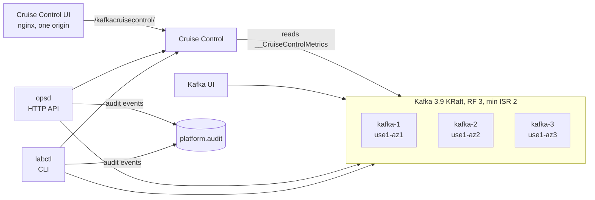

# Kafka platform lab

A local stand-in for an MSK Standard cluster and the platform tools around it: three KRaft brokers across three racks, Kafka UI, Cruise Control with its UI, and a Go ops service (`opsd`) with a break-glass CLI (`labctl`). It runs on Docker (Rancher Desktop) and comes up with one command.

```bash
make up
```

| What | Where |
| --- | --- |
| Kafka UI | http://localhost:8080 |
| Cruise Control UI | http://localhost:8081 |
| opsd API | http://localhost:8090 |
| Cruise Control API | http://localhost:9090/kafkacruisecontrol/ |
| Brokers from the host | `localhost:19092,localhost:19093,localhost:19094` |
| CLI | `bin/labctl` |

Every port binds to 127.0.0.1 only, because opsd, Kafka UI, and Cruise Control have no authentication and can change the cluster. Rancher Desktop's port forwarder (an `ssh` process in `lsof`) owns all of them on the host. That is one listener per port, not a conflict. `bin/opsd` defaults to 127.0.0.1:8090, so it fails fast if the opsd container is up. To run both, give the local one another port: `OPSD_ADDR=127.0.0.1:8091 bin/opsd`.

Broker data is on named volumes, so recreating a container keeps the cluster, as on MSK. `make reset` deletes the volumes.

The first `make up` compiles Cruise Control inside Docker and takes a few minutes. After that it takes under a minute. Cruise Control needs about five minutes of metrics before proposals are ready.

## Architecture



`labctl` and `opsd` are two front doors to the same Go services. The guardrails live in the services, so the CLI and the API refuse the same unsafe moves. See [docs/architecture.md](docs/architecture.md) for the design and why it is shaped this way. The offset reset path — call flow, decision diagrams, and the audit trail — is in [docs/offset-reset-design.md](docs/offset-reset-design.md).

## Layout

```text
cmd/
  labctl/            break-glass CLI
  opsd/              ops HTTP API
internal/
  app/               composition root, the only package that imports dig
  config/            env config, the same names Vault renders at work
  kafka/             franz-go client options: TLS, SCRAM, MSK IAM
  cluster/           broker and partition health
  consumergroup/     lag, and offset reset as plan then apply
  cruisecontrol/     read-only Cruise Control REST client
  audit/             who changed what and why, to logs and a Kafka topic
  httpapi/           opsd routes
  workload/          lab traffic: poison producer, strict consumer
infra/
  compose.yaml       the whole lab
  kafka/             broker image with the metrics reporter, topic script
  cruise-control/    image, properties, capacity
  cruise-control-ui/ nginx proxy and cluster list
  opsd/              image
  terraform/topics/  the same topics as Terraform
api/
  openapi.yaml       the opsd HTTP API contract
docs/
  architecture.md
  production.md
  offset-reset-design.md
  labs/
```

## Commands

```bash
make help          # every target
make up            # build and start
make status        # containers and cluster health
make broker-stop   # BROKER=3 by default
make broker-start
make add-broker    # kafka-4 for the scale-out drill
make test          # vet and unit tests
make down          # stop, keep images
make reset         # stop and delete everything
```

```bash
bin/labctl health                       # exits 3 when the cluster is degraded
bin/labctl lag --group payments-worker
bin/labctl offsets plan --group payments-worker --topic orders --to skip
bin/labctl offsets apply --plan offsets.plan.json --reason "INC-123 poison record"
bin/labctl cc state
bin/labctl cc proposals                 # dry run, no review needed
bin/labctl cc reviews
```

opsd:

```bash
curl localhost:8090/v1/cluster/health
curl localhost:8090/v1/groups/payments-worker/lag
curl -X POST localhost:8090/v1/groups/payments-worker/offsets/plan -d '{"topic":"orders","mode":"skip"}'
curl localhost:8090/v1/cruise-control/proposals
```

Apply takes the plan, a reason, and an `X-Actor` header: `POST /v1/groups/{group}/offsets/apply` with `{"plan": ..., "reason": "..."}`. The full API contract is in [api/openapi.yaml](api/openapi.yaml).

## Pointing the tools at MSK

`labctl` and `opsd` read only environment variables. At work, Vault agent renders them. See [.env.example](.env.example) for SCRAM (port 9096) and IAM (port 9098). The SASL code paths are unit-tested for config, not yet run against a real MSK cluster.

What the lab deliberately does not model from production — TLS everywhere, auth in front of opsd and Kafka UI, real failure domains, a metrics pipeline — is inventoried in [docs/production.md](docs/production.md), with a checklist to run before using these tools at work.

## What Cruise Control is, and why MSK does not have it

Cruise Control is a process beside the cluster. Each broker runs a metrics reporter that publishes load samples. Cruise Control builds a model and proposes replica moves that satisfy an ordered list of goals: rack spread, capacity, then evenness of replicas and leaders. Self-healing is off here, and two-step verification is on, so every change waits on a review board until a human approves it.

MSK Standard does not let you install the reporter, so you cannot run it there. The decisions are the same ones you make with Terraform broker count, storage scaling, and `kafka-reassign-partitions` with throttles. The labs make sure the first proposal you read is not during an incident.

## Drills

1. [Take a consumer out of an incident](docs/labs/01-offset-reset.md). A poison record, a crash loop, then plan and apply an offset move with `labctl`, opsd, or Kafka UI.
2. [Broker loss, then Cruise Control](docs/labs/02-broker-and-rebalance.md). Under-replicated versus under min ISR, reading a proposal, the review board, adding a broker.
3. Chat drill. Have a colleague or an AI assistant page you with a planted incident and grade how you work it: poison record, broker loss, lost records after a bad deploy, or scale-out with Cruise Control.

## Practice order

1. Boot the lab and explain replication factor 3 with `min.insync.replicas` 2.
2. Run the poison drill with `labctl`, then again in Kafka UI.
3. Stop a broker. Say which partitions are still writable and why. Start it and wait for clean health.
4. Read `labctl cc proposals`. Submit a rebalance in the Cruise Control UI and walk it through the review board.
5. For each step, name the tool you would use on MSK.

You are done with a drill when you can do it again without the page in front of you, and you can say what you would refuse to run on a production cluster.

## License

MIT — see [LICENSE](LICENSE). Ground rules for changes are in [CONTRIBUTING.md](CONTRIBUTING.md).
