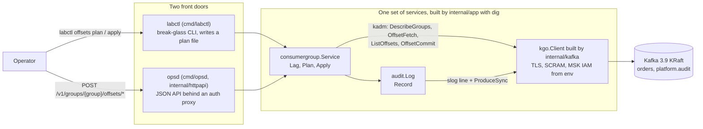
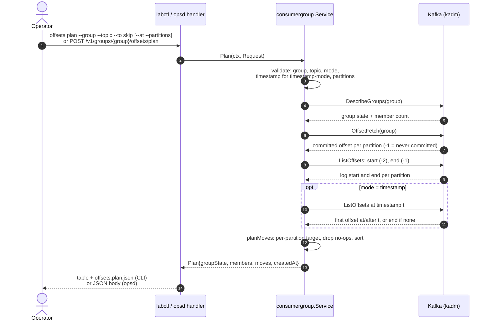
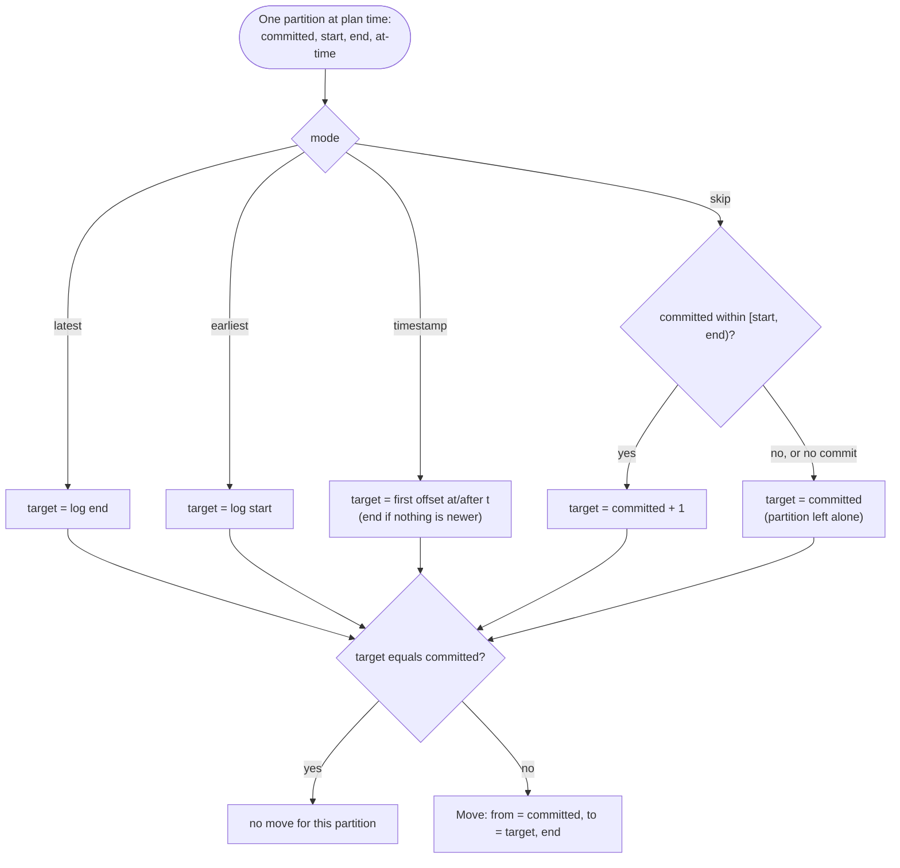
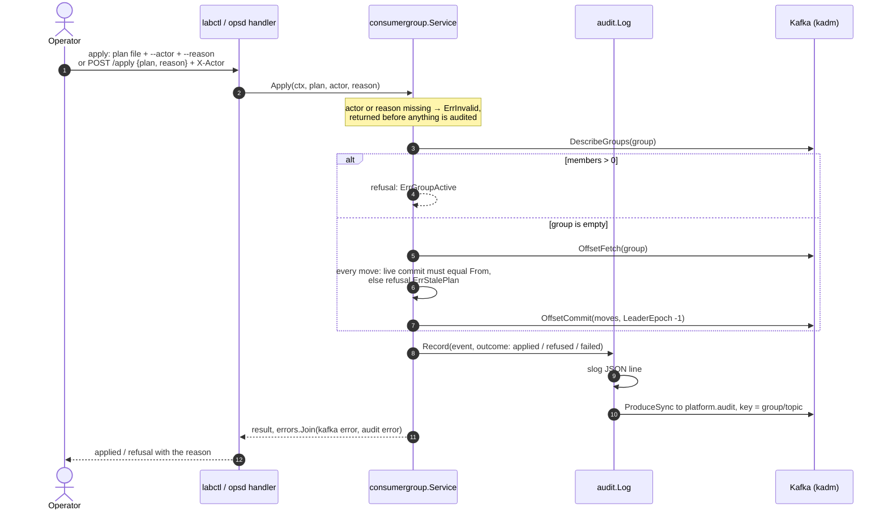

# Offset reset — system design

Moving a consumer group's committed offsets is the most common Kafka incident action and the easiest one to get wrong: reprocess a day of records, or park the group at the log end and silently drop a backlog. This lab implements it the way Terraform treats infrastructure: compute a **plan** first, review it, then **apply** it — and audit every attempt, including the refusals.

This page documents the design: the modules, the tech and why, the exact call flows, the guardrail decisions, and the audit path. For the shape of the whole platform see [architecture.md](architecture.md); for the hands-on drill see [labs/01-offset-reset.md](labs/01-offset-reset.md).

## System design



Two front doors, one set of services. The guardrails live in `internal/consumergroup`, not in the doors, so the CLI and the API refuse the same unsafe moves.

### Module map

| Module | Responsibility |
| --- | --- |
| `cmd/labctl` | CLI. `offsets plan` writes the plan to a file so it can be pasted into the incident channel; `offsets apply` reads it back and sends it to the same service. |
| `cmd/opsd` + `internal/httpapi` | HTTP doors: `GET /v1/groups/{group}/lag`, `POST /v1/groups/{group}/offsets/plan`, `POST /v1/groups/{group}/offsets/apply`. Thin: decode, call one service method, encode. The apply door also refuses a plan whose group does not match the path. |
| `internal/config` | Environment to config, the same variable names Vault agent renders at work. Validates: SASL without TLS is refused. |
| `internal/kafka` | The only place that knows transport: franz-go options for TLS (1.2 minimum), SCRAM-SHA-256/512, and MSK IAM. |
| `internal/consumergroup` | The feature. `plan.go` is pure decision logic — modes, target offsets, moves, no clock, no network. `service.go` does the I/O, the guardrails, and the audit call. |
| `internal/audit` | `Log.Record`: one event to slog and one to the `platform.audit` topic. |
| `internal/app` | dig composition root. Lazy graph — `labctl cc state` never dials Kafka. Closers run LIFO on exit. |

## Tech stack and why

| Choice | Why this |
| --- | --- |
| Go 1.27, stdlib-first | `net/http` 1.22 method+path routing, `slog`, `cmp.Or`, `slices`/`maps`. At this size a web framework adds a dependency, not a capability. |
| franz-go (`kgo`) | Maintained, modern client. SASL SCRAM and AWS MSK IAM are in-tree; sarama needs a separate module for IAM. Producer, consumer, and admin share one client. |
| kadm (on franz-go) | Typed admin API — `DescribeGroups`, `FetchOffsets`, `ListStart/EndOffsets`, `ListOffsetsAfterMilli`, `CommitOffsets` — with per-item error aggregation. |
| uber dig | Both binaries share one graph, and subcommands only construct what they use. `Decorate` swaps the JSON logger for a text one in labctl. A `DryRun` test resolves the whole graph in CI, so a missing provider fails before the first request, not during an incident. |
| JSON plan file | A reviewable artifact: it diffs, it goes into the incident channel for a second pair of eyes, and apply re-reads exactly what was reviewed. `DisallowUnknownFields` catches typos on both doors. |
| Kafka topic for audit | Survives the process and is queryable in Kafka UI next to the incident data. slog mirrors every event, so the line exists even when the produce fails. |

## Plan: call flow



What each call is for:

| Purpose | kadm method | Kafka API |
| --- | --- | --- |
| Group state and member count | `DescribeGroups` | DescribeGroups |
| Committed offsets | `FetchOffsets` | OffsetFetch |
| Log start / log end | `ListStartOffsets` / `ListEndOffsets` | ListOffsets (timestamp −2 / −1) |
| First offset at/after a time | `ListOffsetsAfterMilli` | ListOffsets (timestamp t) |
| Commit the moves (apply) | `CommitOffsets` | OffsetCommit |

Nothing in the plan path writes to Kafka. A plan is a pure read plus local computation.

The plan records the group state and member count it saw, the moves, and a creation time. The CLI writes it to `offsets.plan.json`:

```json
{
  "request": { "group": "payments-worker", "topic": "orders", "mode": "skip" },
  "groupState": "Empty",
  "members": 0,
  "moves": [
    { "partition": 1, "from": 2, "to": 3, "end": 12 }
  ],
  "createdAt": "2026-09-29T21:12:04Z"
}
```

`End` is the log end at plan time, so `End - To` is the lag right after apply.

## Deciding the target offset

`plan.go` is pure logic: same inputs, same moves. Per partition:



| Mode | Target | Use when |
| --- | --- | --- |
| `skip` | committed + 1, only while `start <= committed < end` | a poison record: skip exactly the record the app dies on, nothing else |
| `latest` | log end | park the group and drop the backlog — the unread records are never read |
| `earliest` | log start | replay everything still in retention |
| `timestamp` | first offset at/after t, end if nothing is newer | replay from a time, for example the start of a bad deploy |

A partition whose target equals its committed offset produces no move, so an already-correct plan comes back empty instead of full of no-ops.

## Apply: guardrails, then the call



Every refusal is deliberate, and the reason is the incident, not the mechanism:

| Refusal | Error | HTTP | Why it exists |
| --- | --- | --- | --- |
| the group has members | `ErrGroupActive` | 409 | Kafka would accept the commit, but the running app's next commit overwrites yours. Stop or scale the app to zero first. |
| a live commit differs from the plan's `From` | `ErrStalePlan` | 409 | the plan was built on a stale view — someone moved offsets, or the app wrote a final commit. Plan again. |
| plan has no moves | `ErrEmptyPlan` | 400 | nothing to do; usually means the plan was already applied. |
| bad request (mode, topic, partitions, timestamp) | `ErrInvalid` | 400 | fail before touching Kafka. |
| missing actor or reason | `ErrInvalid` | 400 | an audit entry with no owner or no why is not useful. Refused before the audit is even written. |
| dependency deadline | context | 504 | opsd's caller gets a timeout, not a hang. |
| anything else | — | 502 | dependency failure surfaced as-is. |

CLI exit codes: `0` applied, `1` any error, `2` usage, `3` cluster unhealthy (health only).

The commit carries `LeaderEpoch: -1`: an operator reset has no consumer-side leader epoch, and −1 tells Kafka to skip the stale-epoch check instead of fighting it.

## Auditing

Every apply attempt that has an actor and a reason produces exactly one `audit.Event` — applied, refused, or failed — through `audit.Log`:

```json
{
  "time": "2026-09-29T21:14:02Z",
  "actor": "alice",
  "action": "consumergroup.offsets.apply",
  "target": "payments-worker/orders",
  "reason": "INC-1234 skip poison record orders-1",
  "outcome": "applied",
  "detail": { "request": { "group": "payments-worker", "topic": "orders", "mode": "skip" }, "moves": [ { "partition": 1, "from": 2, "to": 3, "end": 12 } ] }
}
```

- The slog line is written first, so it exists in opsd's logs even when the produce fails.
- The event is produced to `platform.audit` with `Key: group/topic`, so every event for one target lands on one partition, in order. The topic is RF 3, min ISR 2, 30-day retention — created by `infra/kafka/create-topics.sh` and mirrored in `infra/terraform/topics`.
- Refusals are recorded too. In a postmortem, "someone tried to reset while the app was still running" is as useful as the reset itself.
- If the commit succeeds but the audit produce fails, apply returns the audit error: the move stands, the topic does not have it, the log does. The caller sees the inconsistency instead of a clean "applied".

## Design decisions

- **Plan then apply, like Terraform.** The plan is a reviewable artifact for a second pair of eyes, and apply re-checks it against the live cluster — same group state, same commits — instead of trusting the file. Compare-and-swap, not hope.
- **Guardrails in the service, not the doors.** One implementation of "is this safe", used identically by the CLI, the API, and any future door.
- **Skip refuses to guess.** No commit, or a commit outside `[start, end)` — skip leaves the partition alone rather than inventing an offset.
- **Timestamp falls back to the end.** "Nothing after t" should mean "already caught up", not an error.
- **Writes stay on the review board.** This path only moves offsets. Cruise Control actions (rebalance, broker add/remove) go through its two-step verification — see [architecture.md](architecture.md).

## Edge cases

- Plan for group A applied at `/v1/groups/B/...` — the door refuses (`ErrInvalid`) before the service is called.
- `--partitions` naming a partition the topic does not have — `ErrInvalid` at plan time, not a silent partial plan.
- Partitions the group never committed on (`-1`): skip leaves them alone; earliest/latest/timestamp still produce moves for them.
- kadm surfaces per-partition failures as one aggregated error; apply reports it whole rather than half-committing quietly.

## Running it in the lab and at work

Same binaries, different environment. The lab points at `localhost:19092..94` in PLAINTEXT; at work the same variable names come from Vault agent and `internal/kafka` turns on TLS + SCRAM or IAM. See [.env.example](../.env.example) and the gaps and checklist in [production.md](production.md).
